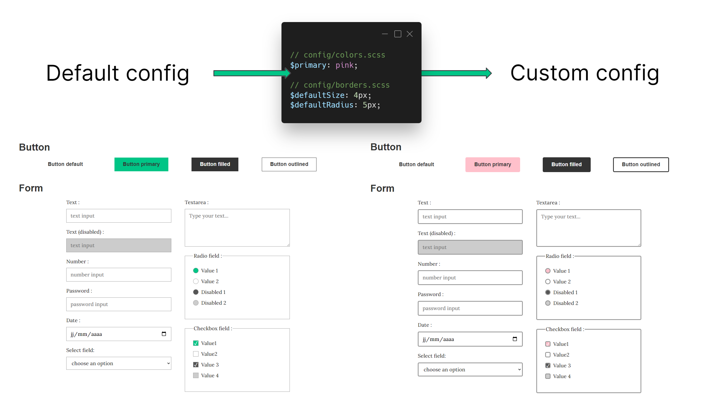
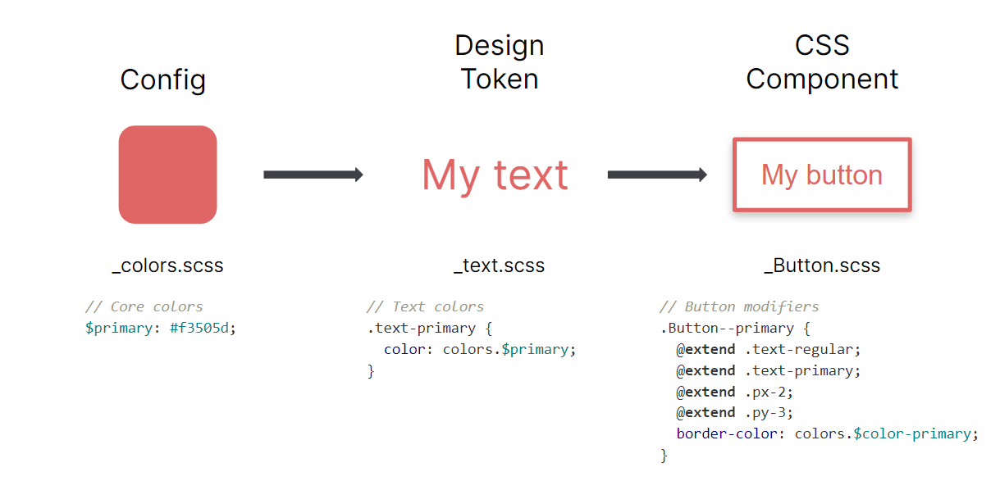

# Guide

## Introduction

Syncss (prononcied /Siŋks/) is a lightweight SASS starter for swiftly crafting design systems, tailored to reflect your design rules.

The principle of Syncss is to isolate all the rules governing your design system into a readily accessible configuration. All the framework's code is available directly within your codebase, allowing you to easily edit it according to your needs.

`config/borders.scss` contains the `$defaultRadius` variable. If you change this value, it will impact many visual elements (such as form inputs or buttons). The same applies to the `$defaultSize` variable for border size or the `$primary` variable in `config/colors.scss`.

## Concepts

Syncss is based on a simple concept, split into three parts:
- Simple **configuration**: where we can easily change the rules of your design system.
- Accessible **helpers**: to use your configuration everywhere.
- Synchronized **components**: to create more complex elements, based on helpers and/or configuration.

