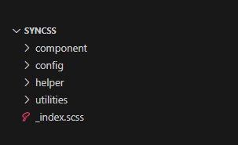
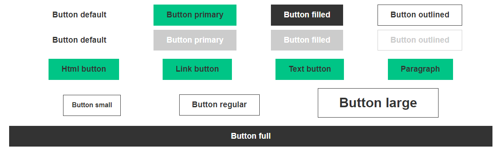

# Usage

Syncss use a specific folder structure. Each part will be explain below.



## Configuration

Initially, I encourage you to browse the files contained in the 'config' folder and input your spacing values, color palette, typographies, and so on.

### Example:
With the default `config/spaces.scss` configuration, `$spaceValue` is equal to `5px` and `$regulatedMultiplicators` sets the multiples of this value available in your design system. With this configuration, we have this table of available spaces:

| Key | Multiples | Value |
| :-: |:-:| :-:|
| 0 | 0 | 0px |
| 1 | 1 | 5px |
| 2 | 2 | 10px |
| 3 | 3 | 15px |
| 4 | 4 | 20px |
| 5 | 6 | 30px |
| 6 | 10 | 50px |
| 7 | 20 | 100px |
| 8 | 40 | 200px |

If you put `$spaceValue: 0.2em;` and `$regulatedMultiplicators: 0, 1, 2, 3, 4, 5, 7, 10, 15, 20;` in your config, this table will automatically update to (note: adding multiplicators will create a new key):
| Key | Multiples | Value |
| :-: |:-:| :-:|
| 0 | 0 | 0em |
| 1 | 1 | 0.2em |
| 2 | 2 | 0.4em |
| 3 | 3 | 0.6em |
| 4 | 4 | 0.8em |
| 5 | 5 | 1em |
| 6 | 7 | 1.4em |
| 7 | 10 | 2em |
| 8 | 15 | 3em |
| 9 | 20 | 4em |

## Helper

When your rules match your design system, helpers will produce design tokens usable everywhere in your project.

### Example:
With the available spacing configuration explained above, we can build more complex rules like the object in the `$config` variable of `config/spaces.scss`. This will produce design tokens like `m-[key]` (`m-0`, `p-2`, `mt-6`, `px-8`, ...) and this with responsiveness if needed.

```
// config/spaces.scss

$config: (
  get(0), // key 0
  get(1), // key 1
  get(2), // key 2
  ( // key 3
    "mobile": get(2),
    "tablet": get(3),
  ),
  ( // key 4
    "mobile": get(3),
    "tablet": get(4),
  ),
  ( // key 5
    "mobile": get(4),
    "tablet": get(5),
  ),
  ( // key 6
    "mobile": get(5),
    "tablet": get(6),
  ),
  ( // key 7
    "mobile": get(5),
    "tablet": get(6),
    "desktop": get(7),
  ),
  ( // key 8
    "mobile": get(6),
    "tablet": get(7),
    "desktop": get(8),
  )
);
```

So with this configuration, `m-1` classe will create a 5px margin, and `pt-8` will create a responsive padding-top (50px on mobile, 100px on tablet, and 200px on desktop).

## Component

This folder contains basic structures for more complex visual elements. Components can use design tokens created before and read some values from the configuration. They can be used on multiple HTML tags (they do not impact semantics) and can apply in-place styles for children elements.

Like in a design system, your components can have visual variations.

> [!NOTE]  
> These are style components and they are not related to JS components like Vue.js or React.

### Example:

`component/Btn.scss` will be built using a lot of helpers like text or spacing, but also with some configuration values like border style, size, or radius. In fact, you can showcase all variants and states of this element as in a Storybook.



## Utilities

This folders can contains other than can't follow the basic usage. `utilities/base.scss` is a normalizer for HTML tags.

## Index

`_index.scss` is the entry point to load all helper and component of Syncss.

More information about how to import it on [Install](/install/#_2-require-syncss-in-your-project) page.